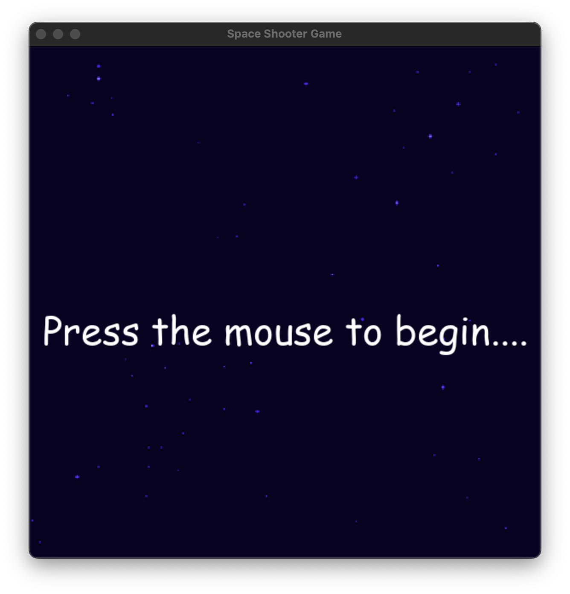

# Arabic

## لعبه اطلاق النار في الفضاء اول لعبه لي ب pygame
هي لعبه بسيطه شوفتها في فديو ومشيت وراه عشان اتعلم اكتر عن pygame بس اللعبه لم تكن حلوه جدا 
فغيرت الصور الي كان حطتها وعملت انيميشن للمركبات وزودت اصوات كمان عشان كانت ممله من غير صوت

## مميزات اللعبه
- حركه الانيميشن للمركبات والطلقات
- نظام الاصوات موسيقي الخلفيه
- المستويات وزياده عدد الاعداء والصعوبه في كل مستوي
- شريط الصحه الذي يتناقص عند لمس الاعداء او الاصابه من طلقات الاعداء
- عدد الأرواح lives التي تقل كلما تخطي عدو الشاشه بدون قتله

## تعلمت ايه جديد
- حاجات كتيره جدا  عشان هو اول مشروع
##### بس أبرزها
- ازاي اتعامل مع عرض الصور في list عشان اعمل عليها انيميشن دي من اكتر الحاجات الي واجهت فيها أخطاء وتعلمت منها
- واستخدام الماسك mask  في التصادم بدل طريقه المربعات الصعبه
- الاصوات طبعا ازاي اتعامل معاها والفرق بين صوت الخلفيه وصوت المؤثرات
- وغيرها كتير من تنظيم الكود ب OOP ، والوراثه بين الكلاسات classes ، وتحريك الطلقات ، وحساب المنتصف السفينه لمكان الاطلاق

## الازرار المستخدمه
- أزرار حركة اللاعب (W, A, S, D)
- زر الضرب (SPACE)

## كيفيه التشغيل للماك
في Releases نزل الملف game_for_mac.zip

## كيفيه التشغيل للوندوز
في Releases نزل الملف game_for_windows.zip

## التشغيل محليا
- تأكد اولا من أن python  مثبته علي جهازك
- نزل الكود من جت هب 
دوس زرار  الاخضر مكتوب عليه code  في الاعلي
أو اعمل (git clone)
اختار download zip

- فك الضغط وافتح المشروع في vscode  او اي محرر اكواد
- واكتب في الترمنتال 
pip install -r requirements.txt
- وبعدها اكتب python game.py واستمتع

## فديو يوتيوب لتجربته اللعبه 
اللينك : https://youtu.be/iK5cxjIL1IM?si=rSHfRdRo51UhY2Uq


# English

## Space Shooter Game – My First Game with Pygame

This is a simple game. I saw it in a video and followed along to learn more about Pygame, but I didn't think the game was very good.

So I changed the images that were originally used, added animations for the spaceships, and included sound effects because the game felt boring without sound.

## Game Features
- Animation for the spaceships and bullets
- Sound system and background music
- Levels with increasing numbers of enemies and higher difficulty in each level
- Health bar that decreases when enemies touch the player or when hit by enemy bullets
- Lives system that decreases whenever an enemy passes the screen without being destroyed

## What I Learned
- A lot of things because this is my first project.

### The Most Important Things
- How to work with images stored in a list to create animations. This was one of the things where I made the most mistakes and learned the most.
- Using masks for collision detection instead of simple rectangle-based collision.
- Working with sounds, including the difference between background music and sound effects.
- And many other things, such as organizing code using OOP, inheritance between classes, moving bullets, and calculating the center of the spaceship to determine the firing position.

## Controls
- Player Movement: **W, A, S, D**
- Shoot: **SPACE**

## How to Run on macOS
Download the **game_for_mac.zip** file from the **Releases** section.

## How to Run on Windows
Download the **game_for_windows.zip** file from the **Releases** section.

## Run Locally
- First, make sure **Python** is installed on your computer.
- Download the project from GitHub.
- Click the green **Code** button at the top.
- Or clone the repository using:

```bash
git clone <repository-url>
```

- Or choose **Download ZIP**.

- Extract the files and open the project in **VS Code** or any code editor.

- Install the required packages:

```bash
pip install -r requirements.txt
```

- Then run the game:

```bash
python game.py
```

Enjoy!

## YouTube Gameplay Video
https://youtu.be/iK5cxjIL1IM?si=rSHfRdRo51UhY2Uq


# Images 



